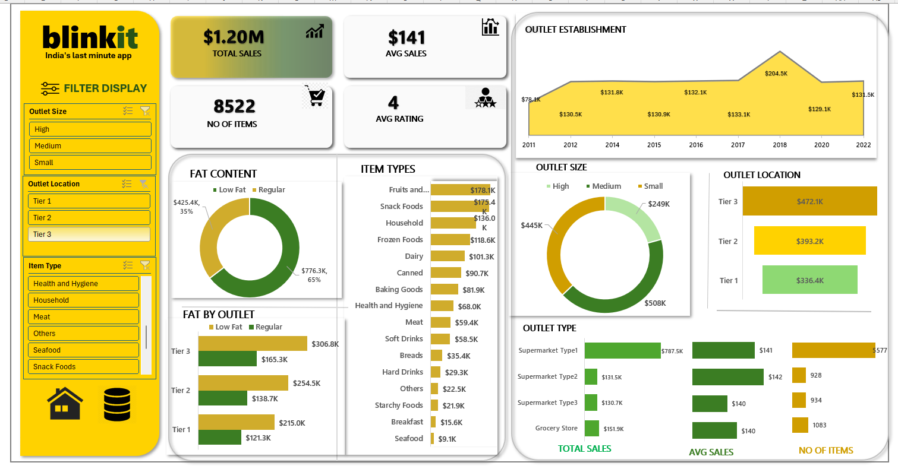

# 🛒 Blinkit Sales Dashboard (Excel Project)

## 📘 Overview
This project showcases an **interactive Excel Dashboard** analyzing Blinkit's sales performance across different outlets, locations, and item categories.  
The dashboard helps visualize **total sales, outlet performance, product trends, and fat content distribution** — all built using Excel’s data visualization and analysis tools.

---

## 🧹 Data Preparation
Before creating the dashboard:
1. **Cleaned the raw dataset** – removed duplicates, handled missing values, standardized formats.  
2. **Created calculated columns** – for average sales, fat category, and item grouping.  
3. **Used Excel tables and named ranges** – to ensure dynamic data referencing.  
4. **Built Pivot Tables** – to summarize key metrics by outlet, location, and item type.

---

## 📊 Key Metrics
| Metric | Value |
|--------|--------|
| 💰 **Total Sales** | **$1.20M** |
| 📦 **No. of Items** | **8,522** |
| 💵 **Average Sales** | **$141** |
| ⭐ **Average Rating** | **4** |

---

## 🧩 Dashboard Insights

### 🏬 Outlet Analysis
- **Highest Sales by Outlet Type:** Supermarket Type 1 ($787.5K)  
- **Tier 3 outlets** lead with **$472.1K** total sales.  
- **Medium-sized outlets** perform best ($508K sales).  

### 🍱 Product Insights
- **Top Selling Items:** Fruits & Vegetables ($178.1K), Snack Foods ($175.4K), Household ($136K).  
- **Low Fat items** contribute **65% ($776.3K)** of total sales, showing consumer preference for healthier options.  

### 🕓 Sales Over Time
- Sales gradually increased from **2011** and peaked in **2018 ($204.5K)** before stabilizing.  

---

## 🧠 Insights Summary
- **Tier 3 locations** and **Medium outlets** are the key sales drivers.  
- **Low Fat** products dominate sales, indicating customer health awareness.  
- **Supermarket Type 1** outlets outperform other outlet types.  
- Sales trend shows consistent growth with a strong peak in **2018**.

---

## 🛠️ Tools & Techniques Used
- **Microsoft Excel**
  - Pivot Tables & Pivot Charts  
  - Data Cleaning & Formatting  
  - Slicers for interactive filtering  
  - Conditional Formatting for highlights  
  - Shapes, icons & charts for visualization

---

## 📁 Project Files
- `Blinkit_Sales_Dashboard.xlsx` – Excel dashboard file  
- `Cleaned_Data.xlsx` – Processed dataset  
- `Dashboard.png` – Dashboard preview image  

---

## 🚀 How to Use
1. Download the Excel file from the repository.  
2. Open in **Microsoft Excel (2016 or later)**.  
3. Use slicers to filter data by **Outlet Size, Location, and Item Type**.  
4. Explore visual trends and KPIs dynamically.

---

## 👩‍💻 Author
**Aashiya Ziya Shaikh**  
 💼 Aspiring Data Analyst  
📧 [aashiyaziya@gmail.com](mailto:aashiyaziya@gmail.com)

---

## 🖼️ Dashboard Preview

